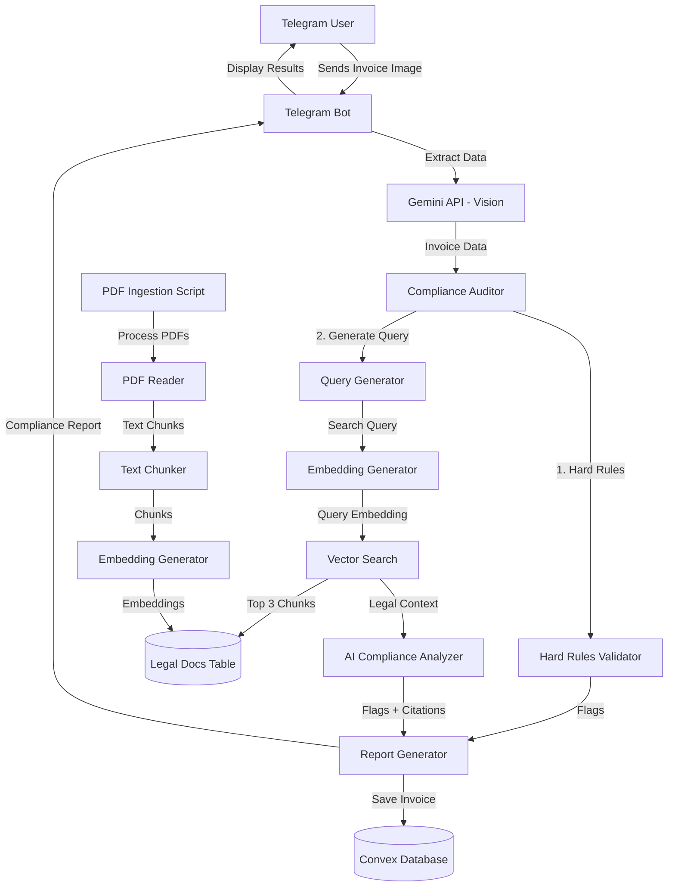

# Design Document: RAG Compliance Engine

## Overview

The RAG Compliance Engine is a sophisticated compliance checking system that combines rule-based validation with AI-powered legal reasoning. The system ingests official GST and Income Tax PDF documents, converts them into searchable vector embeddings, and uses semantic search to retrieve relevant legal text when auditing invoices. This approach enables context-aware compliance decisions based on actual tax law rather than hard-coded business logic.

### Key Design Principles

1. **Hybrid Validation**: Combine fast hard rules (GSTIN format, tax rates) with intelligent RAG-based analysis
2. **Semantic Search**: Use vector embeddings to find relevant legal text based on invoice context
3. **Graceful Degradation**: Fall back to hard rules if RAG components fail
4. **Traceability**: Provide citations to source documents for all compliance decisions
5. **Extensibility**: Design for easy addition of new legal documents and compliance rules

### Architecture Diagram



## Architecture

### System Components

The RAG Compliance Engine consists of six major components:

1. **PDF Ingestion Pipeline**: Processes legal documents and stores them as searchable vectors
2. **Legal Documents Database**: Convex table with vector index for semantic search
3. **Hard Rules Validator**: Fast validation of format and basic compliance rules
4. **RAG Query Engine**: Generates search queries and retrieves relevant legal text
5. **AI Compliance Analyzer**: Uses Gemini with legal context to determine compliance
6. **Compliance Auditor**: Orchestrates the entire audit workflow

### Technology Stack

- **Database**: Convex (serverless database with vector search)
- **Vector Embeddings**: Google text-embedding-004 (768 dimensions)
- **AI Reasoning**: Google gemini-2.5-flash
- **PDF Processing**: pypdf (Python library)
- **Bot Framework**: python-telegram-bot
- **Backend Functions**: TypeScript (Convex serverless functions)
- **Compliance Logic**: Python (app/compliance.py)

### Data Flow

1. **Ingestion Phase** (One-time setup):
   - PDF files → Text extraction → Chunking → Embedding generation → Storage in Convex

2. **Audit Phase** (Per invoice):
   - Invoice image → Data extraction → Hard rules validation → Query generation → Vector search → AI analysis → Report generation → Storage

## Components and Interfaces

### 1. Legal Documents Database Schema

**Convex Schema Definition** (TypeScript):

```typescript
// convex/schema.ts
import { defineSchema, defineTable } from "convex/server";
import { v } from "convex/values";

export default defineSchema({
  // ... existing tables ...
  
  legal_docs: defineTable({
    chunk_text: v.string(),
    source_file: v.string(),
    page_number: v.number(),
    category: v.string(), // "GST" or "Income_Tax"
    embedding: v.array(v.float64()),
  })
    .vectorIndex("by_embedding", {
      vectorField: "embedding",
      dimensions: 768,
      filterFields: ["category", "source_file"],
    })
    .index("by_source", ["source_file"])
    .index("by_category", ["category"]),
});
```

**Design Rationale**:
- 768 dimensions matches Google's text-embedding-004 model
- Filter fields enable category-specific searches (GST vs Income Tax)
- Indexes on source and category support efficient metadata queries
- chunk_text stored as string for direct retrieval without re-processing

### 2. Convex Vector Search Functions

**Add Legal Document Mutation**:

```typescript
// convex/legalDocs.ts
import { mutation, query } from "./_generated/server";
import { v } from "convex/values";

export const addLegalDocument = mutation({
  args: {
    chunk_text: v.string(),
    source_file: v.string(),
    page_number: v.number(),
    category: v.string(),
    embedding: v.array(v.float64()),
  },
  handler: async (ctx, args) => {
    // Validate embedding dimensions
    if (args.embedding.length !== 768) {
      throw new Error(`Invalid embedding dimensions: expected 768, got ${args.embedding.length}`);
    }
    
    await ctx.db.insert("legal_docs", args);
  },
});
```

**Vector Search Query**:

```typescript
export const searchLegalDocs = query({
  args: {
    query_embedding: v.array(v.float64()),
    limit: v.optional(v.number()),
    category: v.optional(v.string()),
  },
  handler: async (ctx, args) => {
    const limit = args.limit ?? 3;
    
    // Build filter if category specified
    const filter = args.category 
      ? (q: any) => q.eq("category", args.category)
      : undefined;
    
    const results = await ctx.db
      .query("legal_docs")
      .withSearchIndex("by_embedding", (q) => 
        q.similar("embedding", args.query_embedding, limit)
          .filter(filter)
      )
      .collect();
    
    return results.map(doc => ({
      chunk_text: doc.chunk_text,
      source_file: doc.source_file,
      page_number: doc.page_number,
      category: doc.category,
      score: doc._score, // Similarity score from vector search
    }));
  },
});
```

**Design Rationale**:
- Mutation validates embedding dimensions to catch errors early
- Query supports optional category filtering for targeted searches
- Default limit of 3 balances context richness with token efficiency
- Returns similarity scores for transparency and debugging

### 3. PDF Ingestion Script

**Architecture**:

```python
# scripts/ingest_pdfs.py
import os
from pypdf import PdfReader
import google.generativeai as genai
from convex import ConvexClient
from typing import List, Dict
import time

class PDFIngestionPipeline:
    def __init__(self, convex_url: str, api_key: str):
        self.convex = ConvexClient(convex_url)
        genai.configure(api_key=api_key)
        self.embedding_model = "models/text-embedding-004"
        
    def process_pdf(self, pdf_path: str, category: str) -> List[Dict]:
        """Extract text from PDF and create chunks."""
        reader = PdfReader(pdf_path)
        chunks = []
        
        for page_num, page in enumerate(reader.pages, start=1):
            text = page.extract_text()
            if not text or text.strip() == "":
                continue
                
            # Chunk the page text
            page_chunks = self.chunk_text(text, page_num)
            chunks.extend(page_chunks)
        
        return chunks
    
    def chunk_text(self, text: str, page_num: int, 
                   chunk_size: int = 1000, overlap: int = 100) -> List[Dict]:
        """Split text into overlapping chunks."""
        chunks = []
        start = 0
        
        while start < len(text):
            end = start + chunk_size
            chunk = text[start:end]
            
            if chunk.strip():  # Skip empty chunks
                chunks.append({
                    "text": chunk,
                    "page_number": page_num,
                })
            
            start += (chunk_size - overlap)
        
        return chunks
    
    def generate_embedding(self, text: str, retries: int = 3) -> List[float]:
        """Generate embedding with retry logic."""
        for attempt in range(retries):
            try:
                result = genai.embed_content(
                    model=self.embedding_model,
                    content=text,
                    task_type="retrieval_document"
                )
                return result['embedding']
            except Exception as e:
                if attempt == retries - 1:
                    raise e
                time.sleep(2 ** attempt)  # Exponential backoff
    
    def ingest_document(self, pdf_path: str, category: str):
        """Complete ingestion pipeline for one PDF."""
        print(f"Processing {pdf_path}...")
        source_file = os.path.basename(pdf_path)
        
        # Extract and chunk
        chunks = self.process_pdf(pdf_path, category)
        print(f"Created {len(chunks)} chunks")
        
        # Generate embeddings and store
        for i, chunk in enumerate(chunks):
            print(f"Processing chunk {i+1}/{len(chunks)}...", end="\r")
            
            embedding = self.generate_embedding(chunk["text"])
            
            self.convex.mutation("legalDocs:addLegalDocument", {
                "chunk_text": chunk["text"],
                "source_file": source_file,
                "page_number": chunk["page_number"],
                "category": category,
                "embedding": embedding,
            })
        
        print(f"\n✅ Completed {source_file}")

def main():
    # Load environment
    from dotenv import load_dotenv
    load_dotenv()
    
    convex_url = os.getenv("CONVEX_URL")
    api_key = os.getenv("GOOGLE_API_KEY")
    
    pipeline = PDFIngestionPipeline(convex_url, api_key)
    
    # Ingest both PDFs
    pipeline.ingest_document("a2017-12.pdf", "GST")
    pipeline.ingest_document("Income-tax-Act-2025.pdf", "Income_Tax")
    
    print("🎉 All documents ingested successfully!")

if __name__ == "__main__":
    main()
```

**Design Rationale**:
- Chunk size of 1000 characters balances context preservation with embedding quality
- 100-character overlap ensures concepts spanning chunk boundaries aren't lost
- Retry logic with exponential backoff handles transient API failures
- task_type="retrieval_document" optimizes embeddings for search use case
- Progress indicators provide feedback during long-running ingestion

### 4. Hard Rules Validator

**Implementation**:

```python
# app/rules.py (enhanced)
import re
from app.schemas import InvoiceData, ExpenseCategory
from typing import List

def validate_gstin(gstin: str) -> bool:
    """Validate GSTIN format: 15 chars, specific pattern."""
    if not gstin or len(gstin) != 15:
        return False
    
    pattern = r'^[0-9]{2}[A-Z]{5}[0-9]{4}[A-Z]{1}[1-9A-Z]{1}Z[0-9A-Z]{1}$'
    return bool(re.match(pattern, gstin))

def validate_gst_rate(total: float, tax: float) -> bool:
    """Check if tax rate matches standard GST rates."""
    if total == 0:
        return True
    
    rate = (tax / (total - tax)) * 100
    standard_rates = [5, 12, 18, 28]
    
    # Allow 0.5% tolerance for rounding
    return any(abs(rate - std_rate) < 0.5 for std_rate in standard_rates)

def check_cash_limit(amount: float, payment_method: str = None) -> List[str]:
    """Check Section 40A(3) cash limit."""
    flags = []
    
    # For now, we warn on all high-value transactions
    # In production, would check actual payment method
    if amount > 10000:
        flags.append("⚠️ Section 40A(3): Cash payments > ₹10,000 are disallowed")
    
    return flags

def check_blocked_itc(category: ExpenseCategory) -> List[str]:
    """Check Section 17(5) blocked ITC categories."""
    flags = []
    
    blocked_categories = {
        ExpenseCategory.FOOD_BEVERAGE: "Section 17(5): Food & Beverage ITC generally blocked",
    }
    
    if category in blocked_categories:
        flags.append(f"🚫 {blocked_categories[category]}")
    
    return flags

def check_math(invoice: InvoiceData) -> List[str]:
    """Verify tax calculations."""
    flags = []
    
    if invoice.tax_amount > 0:
        if not validate_gst_rate(invoice.total_amount, invoice.tax_amount):
            flags.append("⚠️ Tax rate doesn't match standard GST rates (5%, 12%, 18%, 28%)")
    
    return flags

class HardRulesValidator:
    """Orchestrates all hard rule validations."""
    
    def validate(self, invoice: InvoiceData) -> dict:
        """Run all hard rules and return results."""
        flags = []
        status = "compliant"
        
        # GSTIN validation
        if invoice.gstin and not validate_gstin(invoice.gstin):
            flags.append("❌ Invalid GSTIN format")
            status = "review_needed"
        
        # Math validation
        math_flags = check_math(invoice)
        if math_flags:
            flags.extend(math_flags)
            status = "review_needed"
        
        # Cash limit check
        cash_flags = check_cash_limit(invoice.total_amount)
        if cash_flags:
            flags.extend(cash_flags)
            status = "review_needed"
        
        # Blocked ITC check
        itc_flags = check_blocked_itc(invoice.category)
        if itc_flags:
            flags.extend(itc_flags)
            status = "blocked"
        
        return {
            "status": status,
            "flags": flags,
        }
```

**Design Rationale**:
- Regex pattern for GSTIN matches official format specification
- GST rate validation allows 0.5% tolerance for rounding errors
- Cash limit check warns on all high-value transactions (conservative approach)
- Blocked ITC uses enum-based mapping for type safety
- Validator class provides clean interface for orchestration

### 5. RAG Query Engine

**Query Generation**:

```python
# app/rag_query.py
from app.schemas import InvoiceData, ExpenseCategory
from typing import Dict
import google.generativeai as genai

class RAGQueryEngine:
    def __init__(self, api_key: str):
        genai.configure(api_key=api_key)
        self.embedding_model = "models/text-embedding-004"
    
    def generate_search_query(self, invoice: InvoiceData) -> str:
        """Create search query based on invoice context."""
        query_parts = []
        
        # Base query with category and description
        query_parts.append(f"GST compliance for {invoice.category.value}")
        query_parts.append(invoice.item_description)
        
        # Add ITC eligibility if GSTIN present
        if invoice.gstin:
            query_parts.append("input tax credit eligibility")
        
        # Add cash limit context for high-value transactions
        if invoice.total_amount > 10000:
            query_parts.append("cash payment limits Section 40A(3)")
        
        # Add category-specific context
        if invoice.category == ExpenseCategory.FOOD_BEVERAGE:
            query_parts.append("Section 17(5) blocked credits")
        elif invoice.category == ExpenseCategory.TRAVEL:
            query_parts.append("travel expense deduction rules")
        elif invoice.category == ExpenseCategory.PROFESSIONAL_FEES:
            query_parts.append("professional fees TDS requirements")
        
        return " ".join(query_parts)
    
    def generate_query_embedding(self, query: str) -> List[float]:
        """Generate embedding for search query."""
        result = genai.embed_content(
            model=self.embedding_model,
            content=query,
            task_type="retrieval_query"  # Optimized for query use case
        )
        return result['embedding']
    
    def search_legal_docs(self, convex_client, query_embedding: List[float], 
                         limit: int = 3) -> List[Dict]:
        """Execute vector search and return results."""
        results = convex_client.query("legalDocs:searchLegalDocs", {
            "query_embedding": query_embedding,
            "limit": limit,
        })
        return results
    
    def format_legal_context(self, search_results: List[Dict]) -> str:
        """Format retrieved chunks into context string."""
        if not search_results:
            return ""
        
        context_parts = []
        for i, result in enumerate(search_results, 1):
            context_parts.append(
                f"[Source: {result['source_file']}, Page {result['page_number']}]\n"
                f"{result['chunk_text']}\n"
            )
        
        return "\n---\n".join(context_parts)
```

**Design Rationale**:
- Query construction includes category, description, and contextual keywords
- task_type="retrieval_query" optimizes embeddings for search (different from document embeddings)
- Category-specific keywords improve retrieval relevance
- Context formatting includes citations for traceability
- Modular design allows easy testing of each component

### 6. AI Compliance Analyzer

**Implementation**:

```python
# app/rag_analyzer.py
import google.generativeai as genai
from app.schemas import InvoiceData
from typing import Dict, List
import json

class AIComplianceAnalyzer:
    def __init__(self, api_key: str):
        genai.configure(api_key=api_key)
        self.model = genai.GenerativeModel(
            model_name="gemini-2.5-flash",
            generation_config={
                "response_mime_type": "application/json",
                "temperature": 0.1,  # Low temperature for consistent compliance decisions
            }
        )
    
    def analyze_compliance(self, invoice: InvoiceData, legal_context: str) -> Dict:
        """Use AI with legal context to determine compliance."""
        
        prompt = f"""You are a tax compliance expert analyzing an invoice against Indian GST and Income Tax laws.

**Invoice Details:**
- Vendor: {invoice.vendor_name}
- Amount: ₹{invoice.total_amount}
- Tax: ₹{invoice.tax_amount}
- GSTIN: {invoice.gstin or 'Not provided'}
- Category: {invoice.category.value}
- Items: {invoice.item_description}
- Date: {invoice.date or 'Not provided'}

**Relevant Legal Text:**
{legal_context}

**Task:**
Analyze this invoice for compliance issues. Consider:
1. Input Tax Credit (ITC) eligibility based on the category and legal text
2. Any violations of GST or Income Tax provisions
3. Whether the expense is allowable as a business deduction

Return JSON with this structure:
{{
  "status": "compliant" | "review_needed" | "blocked",
  "flags": ["list of specific compliance issues or notes"],
  "itc_eligible": true | false,
  "reasoning": "brief explanation of the decision"
}}

Rules:
- Use "blocked" only if ITC is explicitly disallowed by law
- Use "review_needed" if there are concerns or ambiguities
- Use "compliant" only if clearly allowed
- Base decisions on the provided legal text when available
- Be specific in flags, citing sections when possible
"""
        
        try:
            response = self.model.generate_content(prompt)
            result = json.loads(response.text)
            
            # Validate response structure
            if "status" not in result or result["status"] not in ["compliant", "review_needed", "blocked"]:
                result["status"] = "review_needed"
            
            if "flags" not in result:
                result["flags"] = []
            
            return result
            
        except Exception as e:
            # Fallback on error
            return {
                "status": "review_needed",
                "flags": [f"⚠️ AI analysis failed: {str(e)}"],
                "itc_eligible": False,
                "reasoning": "Unable to complete AI analysis"
            }
```

**Design Rationale**:
- Structured prompt provides clear context and task definition
- JSON output ensures consistent, parseable responses
- Low temperature (0.1) reduces variability in compliance decisions
- Validation ensures response has required fields
- Fallback handling prevents system failure on AI errors
- Reasoning field provides transparency for audit trail

### 7. Compliance Auditor (Orchestrator)

**Complete Audit Workflow**:

```python
# app/compliance.py (enhanced)
from app.schemas import InvoiceData
from app.rules import HardRulesValidator
from app.rag_query import RAGQueryEngine
from app.rag_analyzer import AIComplianceAnalyzer
from convex import ConvexClient
from typing import Dict, List
import os

class ComplianceAuditor:
    def __init__(self):
        self.api_key = os.getenv("GOOGLE_API_KEY")
        self.convex_url = os.getenv("CONVEX_URL")
        self.convex = ConvexClient(self.convex_url)
        
        self.hard_rules = HardRulesValidator()
        self.query_engine = RAGQueryEngine(self.api_key)
        self.ai_analyzer = AIComplianceAnalyzer(self.api_key)
    
    def audit_invoice(self, invoice: InvoiceData) -> Dict:
        """Complete compliance audit workflow."""
        
        # Step 1: Hard rules validation (fast, always runs)
        hard_rules_result = self.hard_rules.validate(invoice)
        
        # Step 2: RAG-based analysis (intelligent, context-aware)
        try:
            # Generate search query
            search_query = self.query_engine.generate_search_query(invoice)
            
            # Get query embedding
            query_embedding = self.query_engine.generate_query_embedding(search_query)
            
            # Search legal documents
            search_results = self.query_engine.search_legal_docs(
                self.convex, 
                query_embedding,
                limit=3
            )
            
            # Format legal context
            legal_context = self.query_engine.format_legal_context(search_results)
            
            # AI analysis with legal context
            if legal_context:
                ai_result = self.ai_analyzer.analyze_compliance(invoice, legal_context)
            else:
                # No legal context found, skip AI analysis
                ai_result = {
                    "status": "review_needed",
                    "flags": ["⚠️ No relevant legal text found"],
                    "itc_eligible": False,
                }
            
            # Extract citations from search results
            citations = [
                {
                    "source": r["source_file"],
                    "page": r["page_number"],
                }
                for r in search_results
            ]
            
        except Exception as e:
            # Fallback to hard rules only
            print(f"RAG analysis failed: {e}")
            ai_result = {
                "status": "review_needed",
                "flags": ["⚠️ Advanced analysis unavailable"],
                "itc_eligible": False,
            }
            citations = []
        
        # Step 3: Combine results
        combined_flags = hard_rules_result["flags"] + ai_result["flags"]
        
        # Determine final status (most restrictive wins)
        status_priority = {"blocked": 3, "review_needed": 2, "compliant": 1}
        final_status = max(
            [hard_rules_result["status"], ai_result["status"]],
            key=lambda s: status_priority[s]
        )
        
        return {
            "status": final_status,
            "flags": combined_flags,
            "category": invoice.category.value,
            "citations": citations,
            "itc_eligible": ai_result.get("itc_eligible", False),
        }

# Backward compatibility: keep the old function signature
def audit_invoice(invoice: InvoiceData) -> Dict:
    """Legacy function for backward compatibility."""
    auditor = ComplianceAuditor()
    return auditor.audit_invoice(invoice)
```

**Design Rationale**:
- Hard rules run first (fast fail for obvious violations)
- RAG analysis adds intelligent context-aware checking
- Graceful degradation: falls back to hard rules if RAG fails
- Status priority ensures most restrictive status wins
- Citations provide traceability to source documents
- Backward compatibility maintained for existing bot code

## Data Models

### Invoice Data Model

```python
# app/schemas.py (existing, no changes needed)
from pydantic import BaseModel, Field
from typing import Optional
from enum import Enum

class ExpenseCategory(str, Enum):
    OFFICE_SUPPLIES = "Office Supplies"
    TRAVEL = "Travel"
    FOOD_BEVERAGE = "Food & Beverage"
    ELECTRONICS = "Electronics"
    PROFESSIONAL_FEES = "Professional Fees"
    UTILITIES = "Utilities"
    RENT = "Rent"
    OTHER = "Other"

class InvoiceData(BaseModel):
    vendor_name: str
    invoice_number: Optional[str] = None
    date: Optional[str] = None
    total_amount: float
    tax_amount: float = 0.0
    gstin: Optional[str] = None
    currency: str = "INR"
    category: ExpenseCategory
    item_description: str
```

### Compliance Report Model

```python
# app/schemas.py (additions)
from typing import List, Dict

class ComplianceReport(BaseModel):
    status: str  # "compliant" | "review_needed" | "blocked"
    flags: List[str]
    category: str
    citations: List[Dict[str, any]]  # [{"source": "...", "page": 123}]
    itc_eligible: bool
```

### Legal Document Chunk Model

```typescript
// Convex schema (already defined above)
interface LegalDocChunk {
  chunk_text: string;
  source_file: string;
  page_number: number;
  category: "GST" | "Income_Tax";
  embedding: number[];  // 768 dimensions
}
```


## Correctness Properties

*A property is a characteristic or behavior that should hold true across all valid executions of a system—essentially, a formal statement about what the system should do. Properties serve as the bridge between human-readable specifications and machine-verifiable correctness guarantees.*

### Property 1: Embedding Dimension Consistency

*For any* text chunk or query processed by the system, the generated embedding SHALL have exactly 768 dimensions, and any attempt to store an embedding with a different dimension count SHALL be rejected.

**Validates: Requirements 1.2, 2.5, 4.3**

### Property 2: Vector Search Result Ordering

*For any* vector search query, the returned results SHALL be ordered by similarity score in descending order (highest similarity first).

**Validates: Requirements 2.3**

### Property 3: Text Chunking Overlap Preservation

*For any* text longer than 1000 characters, consecutive chunks SHALL have exactly 100 characters of overlap, where the last 100 characters of chunk N equal the first 100 characters of chunk N+1.

**Validates: Requirements 3.3**

### Property 4: Page Number Metadata Preservation

*For any* chunk created from a PDF, the chunk SHALL contain the page_number field matching the source page from which the text was extracted.

**Validates: Requirements 3.4**

### Property 5: Whitespace Chunk Rejection

*For any* text chunk that contains only whitespace characters (spaces, tabs, newlines), the system SHALL skip storing that chunk in the database.

**Validates: Requirements 3.6**

### Property 6: GSTIN Format Validation

*For any* string, the GSTIN validator SHALL return true if and only if the string matches the pattern: exactly 15 characters in the format [0-9]{2}[A-Z]{5}[0-9]{4}[A-Z]{1}[1-9A-Z]{1}Z[0-9A-Z]{1}.

**Validates: Requirements 5.1**

### Property 7: GST Rate Validation

*For any* invoice with total_amount > 0 and tax_amount > 0, the calculated tax rate SHALL be within 0.5% of one of the standard GST rates (5%, 12%, 18%, or 28%), or a validation flag SHALL be raised.

**Validates: Requirements 5.2**

### Property 8: Hard Rule Violation Flagging

*For any* hard rule that fails validation, the system SHALL add at least one descriptive flag to the compliance report explaining the violation.

**Validates: Requirements 5.5**

### Property 9: Query Category Inclusion

*For any* invoice, the generated search query SHALL contain the expense category value as a substring.

**Validates: Requirements 6.1**

### Property 10: Query Description Inclusion

*For any* invoice, the generated search query SHALL contain the item_description as a substring.

**Validates: Requirements 6.2**

### Property 11: Conditional Query Enhancement

*For any* invoice with a non-null GSTIN, the generated search query SHALL include "input tax credit eligibility", and for any invoice with total_amount > 10000, the query SHALL include "cash payment limits".

**Validates: Requirements 6.4, 6.5**

### Property 12: Search Result Field Completeness

*For any* document returned by vector search, the result SHALL contain all required fields: chunk_text, source_file, page_number, and category.

**Validates: Requirements 7.4**

### Property 13: Legal Context Concatenation

*For any* non-empty list of search results, the formatted legal context SHALL be a single string containing all chunk_text values separated by delimiters.

**Validates: Requirements 7.6**

### Property 14: Compliance Status Validity

*For any* compliance analysis result (from AI or hard rules), the status field SHALL contain exactly one of these values: "compliant", "review_needed", or "blocked".

**Validates: Requirements 8.6**

### Property 15: Compliance Report Structure

*For any* compliance report generated by the auditor, the report SHALL contain all required keys: status, flags (as a list), category, and citations (as a list).

**Validates: Requirements 9.8**

### Property 16: Flag Aggregation Completeness

*For any* compliance audit, the final report flags SHALL include all flags from both hard rules validation and RAG analysis, with no flags lost during aggregation.

**Validates: Requirements 9.1**

### Property 17: Status Priority Resolution

*For any* compliance audit with multiple status values from different validators, the final status SHALL be the most restrictive status according to the priority: blocked > review_needed > compliant.

**Validates: Requirements 9.3**

### Property 18: Citation Inclusion with Legal Context

*For any* compliance report where vector search returned results, the report SHALL include citations with source_file and page_number for each retrieved document.

**Validates: Requirements 9.4**

### Property 19: Invoice Storage Completeness

*For any* invoice stored in the database, the record SHALL include all required fields: telegram_id, vendor, amount, status, category, compliance_flags, and timestamp.

**Validates: Requirements 10.4, 10.5, 10.6**

### Property 20: Error Logging Completeness

*For any* error that occurs during system operation, a log entry SHALL be created containing a timestamp, error message, and contextual information about the operation that failed.

**Validates: Requirements 12.6**

### Property 21: Missing Environment Variable Detection

*For any* required environment variable (GOOGLE_API_KEY, CONVEX_URL) that is not set, the system SHALL raise a clear error message identifying the missing variable before attempting to process requests.

**Validates: Requirements 13.6**

## Error Handling

### Error Categories and Strategies

1. **External API Failures** (Gemini, Convex):
   - **Strategy**: Retry with exponential backoff (3 attempts)
   - **Fallback**: Proceed with hard rules only, set status to "review_needed"
   - **User Impact**: Inform user that advanced analysis is unavailable

2. **PDF Processing Errors**:
   - **Strategy**: Log error, skip problematic file, continue with other files
   - **Fallback**: None (ingestion is one-time setup)
   - **User Impact**: Administrator notified via logs

3. **Vector Search Failures**:
   - **Strategy**: Log error, proceed with hard rules validation
   - **Fallback**: Hard rules only
   - **User Impact**: Transparent (user receives compliance report)

4. **Invalid Input Data**:
   - **Strategy**: Validate early, reject with clear error message
   - **Fallback**: None (user must provide valid input)
   - **User Impact**: Clear error message explaining the issue

5. **Database Operation Failures**:
   - **Strategy**: Retry once, then fail with error message
   - **Fallback**: None (data persistence is critical)
   - **User Impact**: Error message asking user to retry

### Error Response Format

All errors returned to users follow this structure:

```python
{
    "status": "error",
    "message": "User-friendly error description",
    "error_code": "SPECIFIC_ERROR_CODE",
    "retry_possible": True/False
}
```

### Graceful Degradation Path

```
Full RAG Analysis (Best)
    ↓ (Gemini API fails)
Hard Rules + No AI Analysis
    ↓ (Vector Search fails)
Hard Rules Only
    ↓ (Hard Rules fail)
Status: "review_needed" with generic flag
```

## Testing Strategy

### Dual Testing Approach

The RAG Compliance Engine requires both **unit tests** and **property-based tests** for comprehensive coverage:

- **Unit tests**: Verify specific examples, edge cases, and integration points
- **Property tests**: Verify universal properties across randomized inputs

Both testing approaches are complementary and necessary. Unit tests catch concrete bugs in specific scenarios, while property tests verify general correctness across a wide input space.

### Property-Based Testing Configuration

**Library Selection**:
- **Python**: Use `hypothesis` library for property-based testing
- **TypeScript**: Use `fast-check` library for Convex function testing

**Test Configuration**:
- Minimum 100 iterations per property test (due to randomization)
- Each property test MUST reference its design document property
- Tag format: `# Feature: rag-compliance-engine, Property {number}: {property_text}`

**Example Property Test Structure**:

```python
# test_compliance_properties.py
from hypothesis import given, strategies as st
from app.compliance import ComplianceAuditor
from app.schemas import InvoiceData, ExpenseCategory

# Feature: rag-compliance-engine, Property 19: Invoice Storage Completeness
@given(
    telegram_id=st.text(min_size=1),
    vendor=st.text(min_size=1),
    amount=st.floats(min_value=0.01, max_value=1000000),
    category=st.sampled_from(ExpenseCategory),
)
def test_invoice_storage_has_required_fields(telegram_id, vendor, amount, category):
    """For any invoice stored, all required fields must be present."""
    invoice = InvoiceData(
        vendor_name=vendor,
        total_amount=amount,
        category=category,
        item_description="test items"
    )
    
    auditor = ComplianceAuditor()
    result = auditor.audit_invoice(invoice)
    
    # Verify all required fields present
    assert "status" in result
    assert "flags" in result
    assert isinstance(result["flags"], list)
    assert "category" in result
    assert "citations" in result
```

### Unit Testing Focus Areas

Unit tests should focus on:

1. **Specific Examples**:
   - Valid GSTIN: "29ABCDE1234F1Z5"
   - Invalid GSTIN: "123456789012345"
   - Known PDF with expected chunk count

2. **Edge Cases**:
   - Empty PDF pages
   - Invoices with missing optional fields
   - Zero tax amount
   - Exact ₹10,000 amount (boundary)

3. **Integration Points**:
   - Bot → AI extraction → Compliance audit → Storage
   - PDF ingestion → Embedding → Storage → Search
   - Hard rules + RAG → Report generation

4. **Error Conditions**:
   - API timeout simulation
   - Invalid API key
   - Corrupted PDF file
   - Malformed AI response

### Test Coverage Goals

- **Core compliance logic**: 80% code coverage minimum
- **Hard rules validators**: 100% code coverage (critical path)
- **Error handling**: All error paths tested
- **Property tests**: All 21 properties implemented

### Testing Workflow

1. **Development**: Write unit tests alongside implementation
2. **Property Tests**: Implement after core functionality works
3. **Integration Tests**: Test end-to-end workflows
4. **Manual Testing**: Test with real PDFs and invoices
5. **Regression Tests**: Add tests for any bugs found in production

### Mock Strategy

**External Dependencies to Mock**:
- Gemini API calls (embedding and analysis)
- Convex database operations
- Telegram bot API calls
- File system operations (for PDF reading)

**Real Dependencies**:
- Hard rules validation logic
- Query generation logic
- Data model validation (Pydantic)
- Text chunking algorithms

## Implementation Notes

### Phase 1: Database and Ingestion (Foundation)

1. Update Convex schema with legal_docs table
2. Implement Convex functions (addLegalDocument, searchLegalDocs)
3. Create PDF ingestion script
4. Test ingestion with both PDFs
5. Verify vector search works with sample queries

### Phase 2: RAG Engine (Core Intelligence)

1. Implement RAGQueryEngine (query generation and search)
2. Implement AIComplianceAnalyzer (AI reasoning)
3. Enhance HardRulesValidator (existing code)
4. Create ComplianceAuditor orchestrator
5. Test with sample invoices

### Phase 3: Bot Integration (User-Facing)

1. Update bot.py to use new ComplianceAuditor
2. Format compliance reports for Telegram display
3. Add citation display
4. Test end-to-end with real images
5. Deploy and monitor

### Configuration Requirements

**Environment Variables**:
```bash
GOOGLE_API_KEY=<your-gemini-api-key>
CONVEX_URL=<your-convex-deployment-url>
TELEGRAM_TOKEN=<your-bot-token>
```

**Python Dependencies** (add to requirements.txt):
```
pypdf>=3.0.0
google-generativeai>=0.3.0
hypothesis>=6.0.0  # For property-based testing
```

**TypeScript Dependencies** (add to package.json):
```json
{
  "devDependencies": {
    "fast-check": "^3.0.0"
  }
}
```

### Performance Considerations

1. **Embedding Cache**: Consider caching embeddings for identical queries to reduce API calls
2. **Batch Processing**: Process multiple chunks in parallel during ingestion
3. **Connection Pooling**: Reuse Convex client connections
4. **Lazy Loading**: Only load RAG components when needed (not for hard rules only)

### Security Considerations

1. **API Key Protection**: Never log or expose API keys
2. **Input Validation**: Sanitize all user inputs before processing
3. **Rate Limiting**: Implement rate limiting for bot requests
4. **Data Privacy**: Don't log sensitive invoice data (amounts, vendor names)
5. **Access Control**: Ensure users can only access their own invoices

### Monitoring and Observability

**Key Metrics to Track**:
- Compliance audit latency (p50, p95, p99)
- Vector search accuracy (relevance of retrieved chunks)
- Hard rules vs RAG disagreement rate
- API failure rate and retry success rate
- User satisfaction (blocked vs compliant ratio)

**Logging Strategy**:
- INFO: Successful operations, audit results
- WARNING: Fallback to hard rules, retry attempts
- ERROR: API failures, database errors, unexpected exceptions
- DEBUG: Detailed query generation, search results, AI prompts

### Future Enhancements

1. **Multi-Language Support**: Add support for regional language PDFs
2. **Custom Rules**: Allow users to define custom compliance rules
3. **Audit Trail**: Store detailed audit history for each invoice
4. **Batch Analysis**: Analyze multiple invoices at once
5. **Confidence Scores**: Add confidence scores to compliance decisions
6. **Interactive Clarification**: Ask users for clarification when ambiguous
7. **Learning from Feedback**: Improve RAG based on user corrections
